<!-- 
     ██╗  ██╗ ██████╗ ███╗   ███╗ ██████╗ ██████╗ ███████╗██████╗ ██╗
     ██║ ██╔╝██╔═══██╗████╗ ████║██╔═══██╗██╔══██╗██╔════╝██╔══██╗██║
     █████╔╝ ██║   ██║██╔████╔██║██║   ██║██████╔╝█████╗  ██████╔╝██║
     ██╔═██╗ ██║   ██║██║╚██╔╝██║██║   ██║██╔══██╗██╔══╝  ██╔══██╗██║
     ██║  ██╗╚██████╔╝██║ ╚═╝ ██║╚██████╔╝██║  ██║███████╗██████╔╝██║
     ╚═╝  ╚═╝ ╚═════╝ ╚═╝     ╚═╝ ╚═════╝ ╚═╝  ╚═╝╚══════╝╚═════╝ ╚═╝
-->
<div align="center">

<br>


<br><br>

# ˗ˏˋ crydo-startpage ˎˊ˗

**your cozy corner of the internet**

<br>

<a href="https://readme-typing-svg.demolab.com/demo/">
  
</a>

<br><br>

[**📦 Download**](https://github.com/FabioPelagaggi/crydo-startpage/releases/latest) ·
[**⭐ Star**](https://github.com/FabioPelagaggi/crydo-startpage)

<br>

</div>

\---

### ☕ what's this?

> \*\*komorebi\*\* \*(木漏れ日)\* — japanese for \*"sunlight filtering through leaves"\*

A personalized browser startpage for late night coders, students, and anyone who wants their new tab to feel like *home*. Forked and heavily customized from the original [komorebi-startpage](https://github.com/cookedzera/komorebi-startpage).

<br>

### ✨ features

|||
|-|-|
|🌧️ **ambient sounds**|rain, sparkle, Dragon Ball Lofi & more|
|🎵 **ambient memory & progress**|auto-resumes songs across reloads, interactive progress bar & play/pause toggle|
|⚙️ **in-app settings**|visually configure your startpage (triple-tap or click gear)|
|💰 **currency tracker**|live exchange rates for USD, CAD, EUR, and BRL with customizable base currency|
|💬 **anime quotes**|iconic quotes from Master Roshi, Goku, and Vegeta|
|🕰️ **clock format options**|toggle between 12-hour (AM/PM) and 24-hour clock formats|
|🖼️ **custom banners**|20+ lofi animated backgrounds per tab|
|🌅 **configurable wallpaper**|swap background visually in settings|
|🎮 **gaming tab**|links for MTG, EDHREC, Scryfall & more|
|🛒 **shopping tab**|Mercado Livre, Amazon, Shopee, AliExpress|
|📺 **streaming tab**|YouTube, Netflix, Prime Video, Disney+, Crunchyroll|
|🔮 **pastel blur background**|CSS filter applied in-app, no image editing needed|
|⚡ **zero bloat**|no frameworks, just vibes|
|🌙 **dark mode**|easy on the eyes at 3am|
|📂 **auto-discovery**|drop media into folders and they appear in-app automatically|

<br>

---

### 🛠️ tech stack

- **HTML5 & CSS3**: Modern styling with CSS variables, Flexbox, and Grid for a fully responsive layout.
- **Vanilla JavaScript (ES6)**: Pure JS with absolutely zero bloat or heavy frameworks.
- **Web Components**: Encapsulated UI components using the Shadow DOM for modularity and styling isolation.
- **LocalStorage API**: Persistent client-side storage for all your settings, widget configurations, and state memory.

<br>

---

### 📸 gallery

<div align="center">

|chill tab ☕|gaming tab 🎮|
|:-:|:-:|
|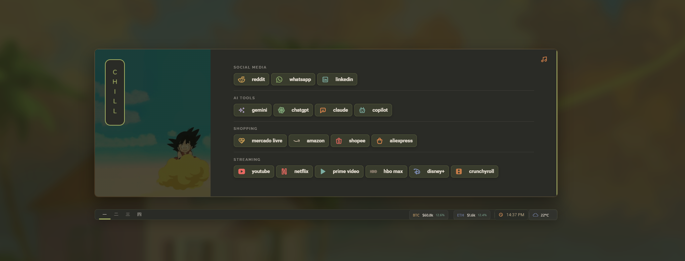|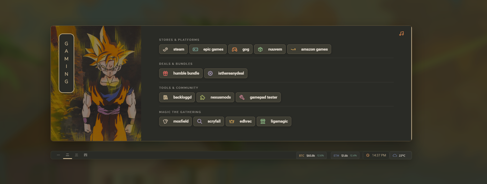|

|myself tab 🌙|storage tab 📦|
|:-:|:-:|
|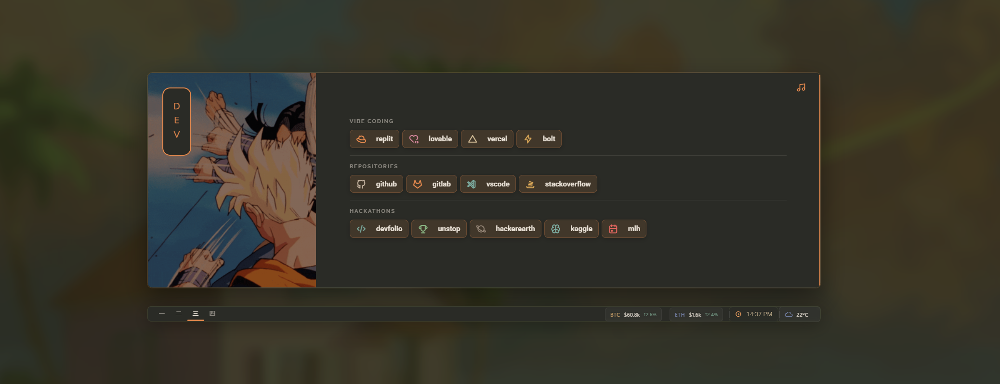|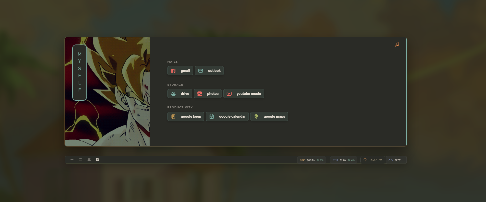|

</div>

<br>

---

### 🗂️ tabs

This startpage is organized into **4 tabs**, each with its own color accent, banner GIF, and curated links:

|Tab|Accent|Sections|
|-|-|-|
|🌸 **Chill**|Olive `#a9b665`|Social Media, AI Tools, Shopping, Streaming|
|🎮 **Gaming**|Gold `#d4be98`|Game Launchers, Communities, Magic The Gathering|
|🌙 **Myself**|Orange `#e78a4e`|Personal links|
|📦 **Storage**|Teal `#7daea3`|Google Keep, Calendar, Maps, YouTube Music|

<br>

---

### 🎮 controls

```
┌─────────────────────────────────────────┐
│  [s]        →  search                   │
│  [1-4]      →  switch tabs              │
│  [⌘ + K]   →  command palette (beta)    │
│  triple-tap →  open settings            │
│  gear icon  →  open settings            │
└─────────────────────────────────────────┘
```

<br>

---

### 🖼️ banners

<div align="center">

*pick your vibe — assign any banner to any tab in `userconfig.js`*

|||||
|:-:|:-:|:-:|:-:|
|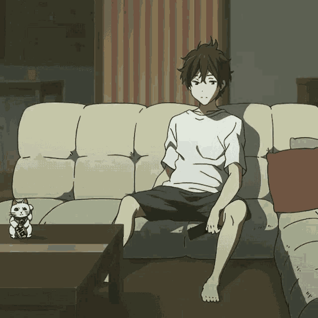||||
||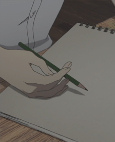||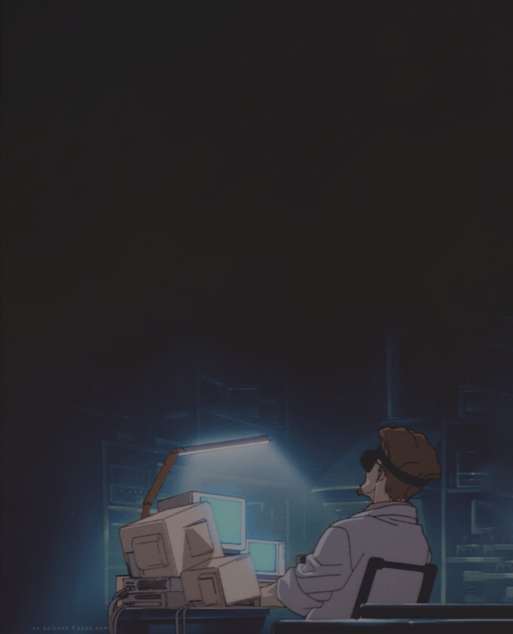|
||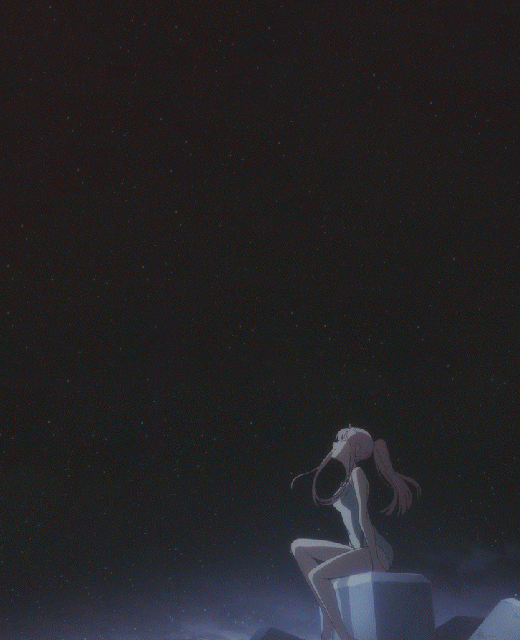||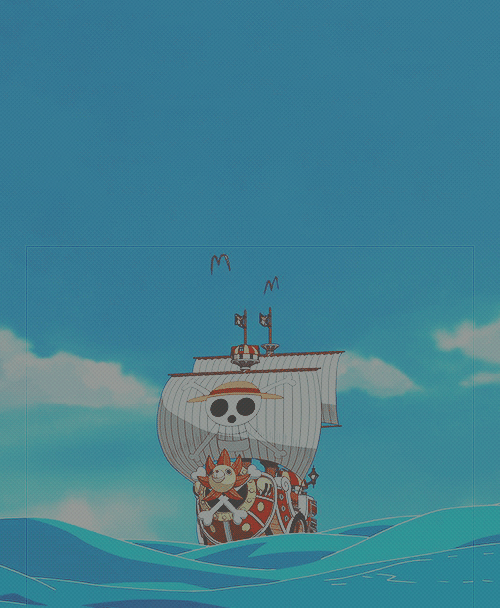|
|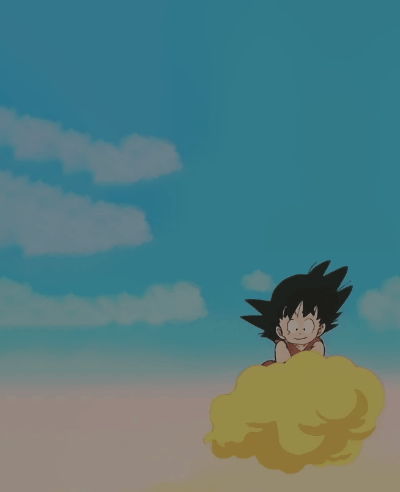|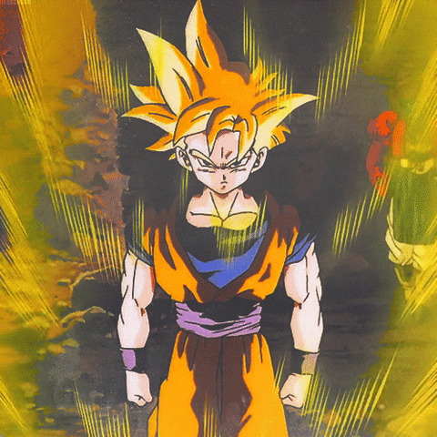||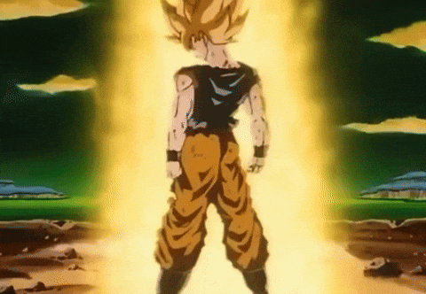|
|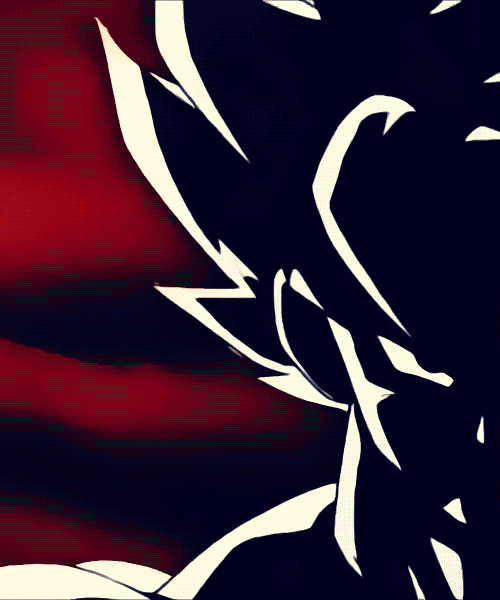|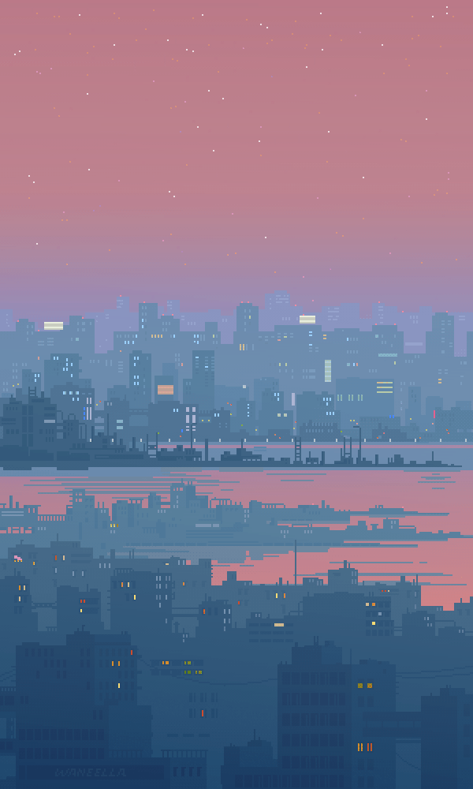|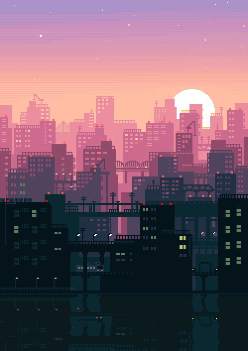|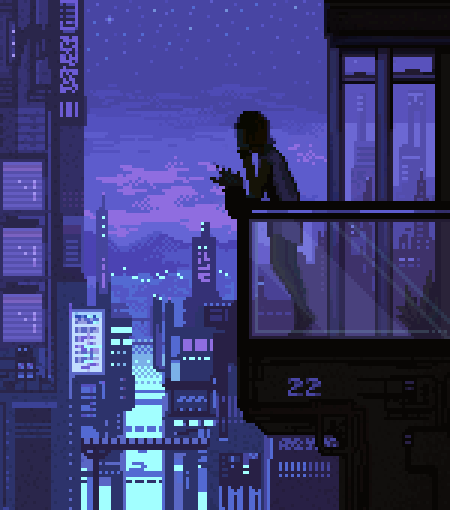|

</div>

<br>

---

### 🚀 install

<details>
<summary><b>Chrome / Edge</b></summary>

```bash
# 1. download or clone this repo
# 2. go to chrome://extensions
# 3. enable "Developer mode"
# 4. click "Load unpacked" → select folder
# 5. open new tab ✨
```

</details>

<details>
<summary><b>Firefox / LibreWolf</b></summary>

```bash
# 1. rename manifest.firefox.json → manifest.json
# 2. go to about:debugging
# 3. click "Load Temporary Add-on"
# 4. select the manifest file
```

> **💡 New Tab not working?**  
> Firefox blocks new tab overrides by default. Use one of these:
> - Install **[New Tab Override](https://addons.mozilla.org/en-US/firefox/addon/new-tab-override/)** extension
> - Set as **homepage** instead (works perfectly!)
> - Or just bookmark `index.html` ☺️

</details>

<details>
<summary><b>Just open in browser</b></summary>

```bash
# double-click index.html
# that's it 🎉
```

</details>

<br>

---

### 🎨 make it yours

Edit `userconfig.js` or use the **In-App Settings Menu** (click the gear icon bottom-right) to customize your startpage.

```js
// your name
userName: "crydo",

// change the background wallpaper (drop any image in src/img/backgrounds/)
wallpaper: "src/img/backgrounds/kamehouse.jpg",

// add your quotes
customQuotes: [
  { text: "stay cozy.", author: "you" }
],

// add your links with custom icons
bookmarks: [
  { name: "GitHub", url: "https://github.com", icon: "brand-github" }
],

// configure tabs with accent color, banner GIF, and link sections
tabs: [
  {
    name: "chill",
    accent: "#a9b665",
    background_url: "src/img/banners/cbg-7.gif",
    categories: [ ... ]
  }
]
```

### ✨ Visual Customization
The built-in settings UI lets you:
- Change your name
- Configure default search shortcuts
- Visually select wallpapers and tab banners from a beautiful grid!

> **🌅 Custom Wallpaper & Banners (Auto-Discovery!)**  
> Simply drop any `.jpg` or `.png` into `src/img/backgrounds/` or `.gif` into `src/img/banners/`!
> The app will automatically scan these folders and the new images will instantly appear in the visual settings UI for you to select. No manual coding required!
> The blur, darkening, and pastel overlay are all applied automatically in-app!

> **🎨 Want custom icons?**  
> Browse **[Tabler Icons](https://tabler-icons.io/)** and use any icon name!  
> Example: `icon: "brand-spotify"`, `icon: "heart"`, `icon: "coffee"`

<br>

---

### 🎵 ambient sounds

The ambient player supports auto-discovery for local files! 

> **Drop any `.mp3` into `src/assets/`!**
> The startpage will automatically scan the folder and your tracks will instantly appear in the Ambient Player menu in the bottom left corner. No configuration needed!

<br>

---

<div align="center">

### 💚

made with insomnia \& good vibes

<br>

*forked from* [*cookedzera/komorebi-startpage*](https://github.com/cookedzera/komorebi-startpage)

<br>

<sub>if you like it, leave a ⭐</sub>

<br><br>


</div>

